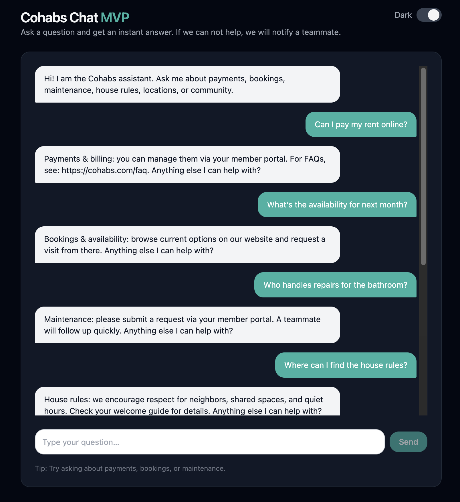
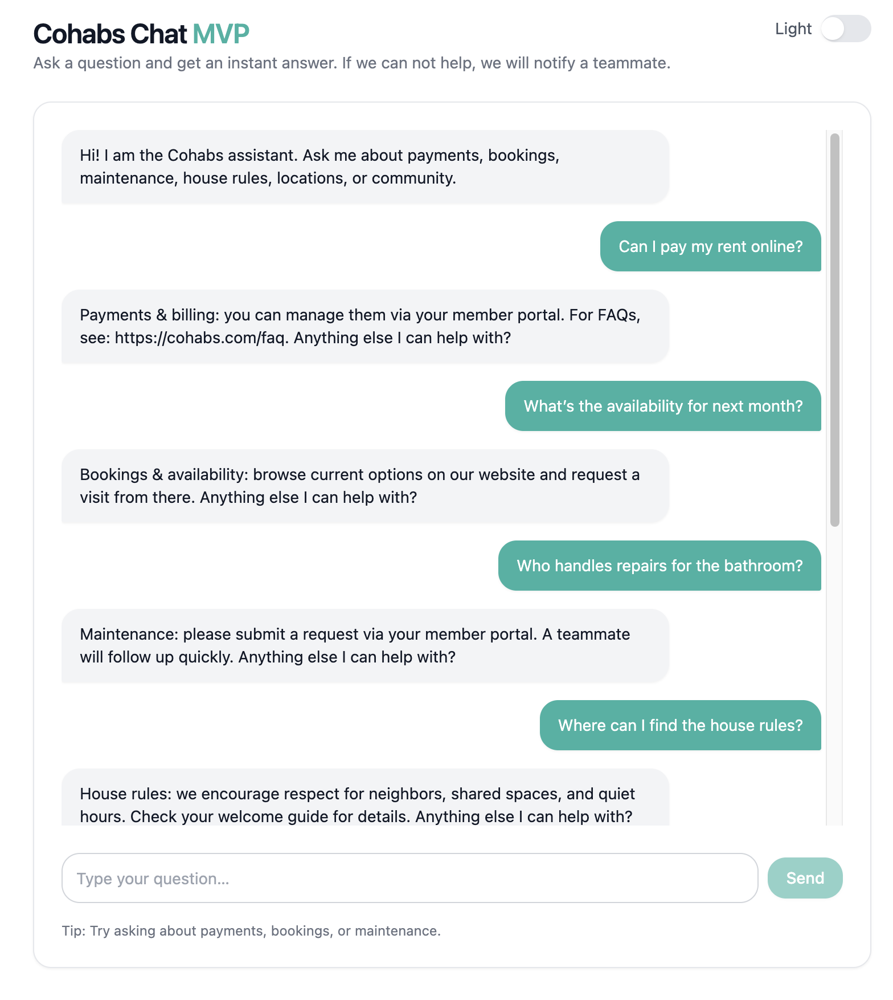
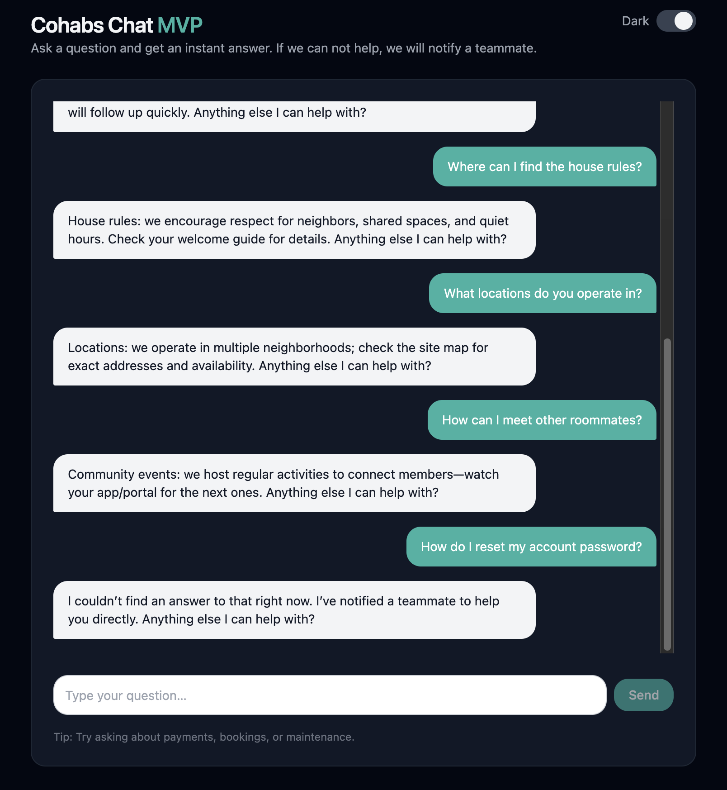
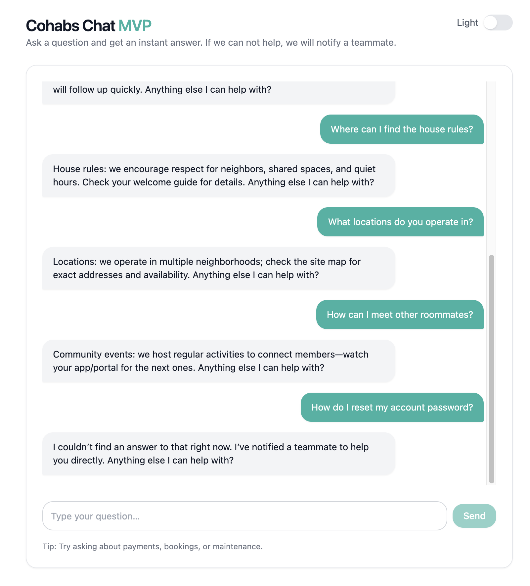
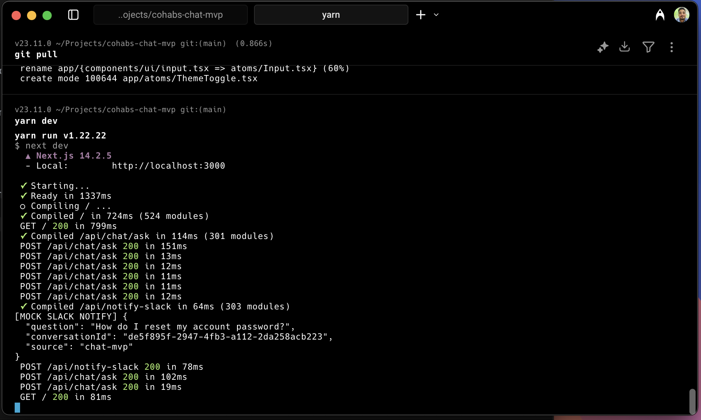
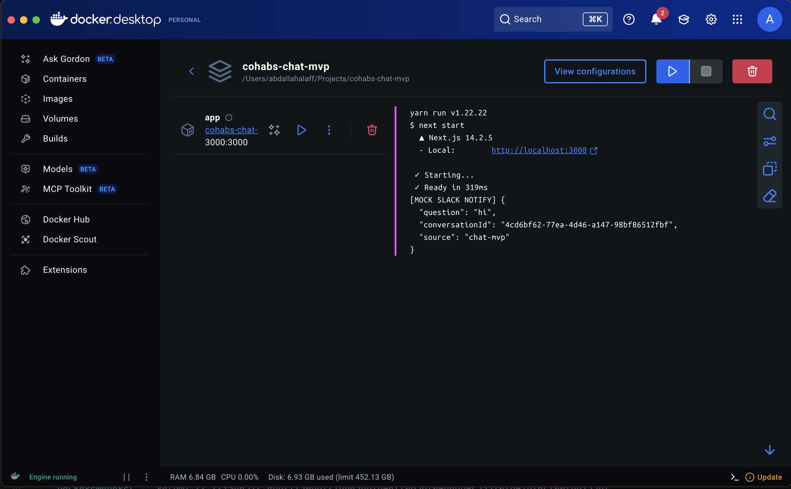

# Cohabs Chat — MVP

A minimal full‑stack chat MVP where users can ask questions about Cohabs and receive simple, rule‑based answers. Unhandled questions trigger a mocked Slack notification and the bot always ends with "Anything else I can help with?".

## 📸 Screenshots

### Client Side / FE

| Dark Mode                                          | Light Mode                                           |
| -------------------------------------------------- | ---------------------------------------------------- |
|  |  |
|  |  |

### Server Side / BE

| Server logs                                           |
| ----------------------------------------------------- |
|  |

### Docker

| Docker                                         |
| ---------------------------------------------- |
|  |

## 🎯 Additional Excellent Features

- **Dark mode**: Try switch the ThemeToggle.
- **Conversation management**: Unique conversation IDs with message persistence
- **Error handling**: Network errors and malformed requests handled gracefully
- **TypeScript**: Fully typed implementation
- **User experience**: Disabled states, loading indicators, proper form validation

## Tech Stack

- **Next.js 14 (App Router) + TypeScript** — FE + Node API in one project
- **Tailwind CSS + radix-ui components** — quick, clean UI
- **In‑memory conversation store** — zero setup
- **Native fetch** — no axios
- **Rules engine** — regex/keyword matching in `lib/rules.ts`
- **Mocked Slack notify** — `POST /api/notify-slack` logs payload to server console

### Why Next.js Over React.js?

**Next.js = Full-Stack Simplicity:** Instead of managing separate React frontend + Express/Node backend, Next.js provides both in one unified project. This means:

- **Built-in API Routes** — Create `/api/chat/ask` endpoints directly in your app structure
- **Zero Backend Setup** — No Express server configuration, CORS handling, or separate deployment
- **Shared TypeScript** — Same types across frontend and backend code
- **Single Development Server** — One `yarn dev` command runs everything
- **Unified Deployment** — Deploy to Vercel/Netlify as one app, not two separate services
- **App Router Benefits** — Modern routing, layouts, and React Server Components

**For an MVP:** This eliminates the complexity of coordinating two separate codebases and deployments, letting you focus on the actual chat functionality rather than infrastructure setup.

## Quick Start

**Requirements**: Node 18+ and Yarn

```bash
yarn install     # Install dependencies
yarn dev         # Start development server
yarn build       # Build for production
yarn start       # Start production server
yarn lint        # Check code quality
```

Visit http://localhost:3000 and start chatting.

## API

### POST `/api/chat/ask`

**Body**

```json
{ "message": "string", "conversationId": "optional string" }
```

**Response**

```json
{ "conversationId": "string", "reply": "string", "answered": true | false }
```

- Matches against a small ruleset (payments, bookings, maintenance, house rules, locations, community).
- If no rule matches, returns a fallback response **and** triggers a mocked Slack notify.

### POST `/api/notify-slack` (mocked)

**Body**

```json
{ "question": "string", "conversationId": "string", "source": "chat-mvp" }
```

**Response**

```json
{ "ok": true, "mocked": true }
```

- Simply logs the payload to the server console. No external calls.

## Storage

- Default is **in‑memory** (no configuration). A new `conversationId` is created on first message.
- (Optional) You can extend this with SQLite/Prisma, but it's not required for this MVP.

## Notes & Decisions

- Rules‑first for deterministic outputs; small, readable ruleset.
- AI, auth, persistence, and tests are intentionally **out of scope** for Day 0–1.
- The bot always appends **"Anything else I can help with?"**

## Known Limitations

- In‑memory storage resets on server restart.
- No authentication, analytics, or real Slack integration.
- Minimal accessibility and i18n (good next steps).
